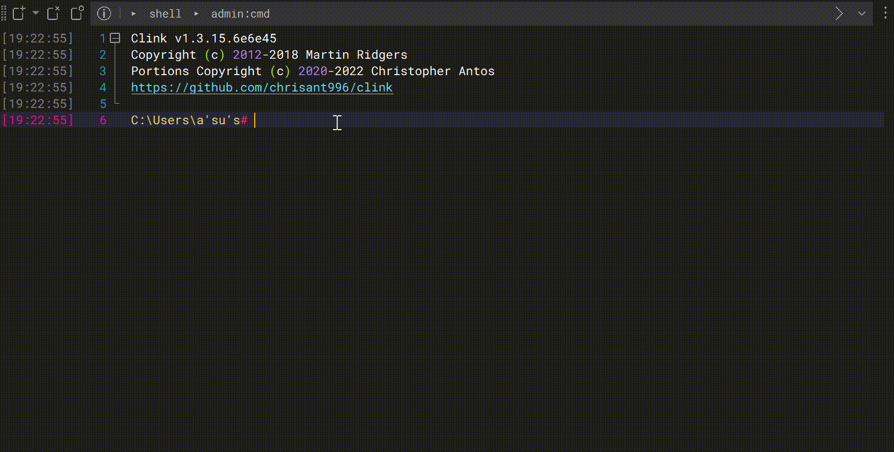
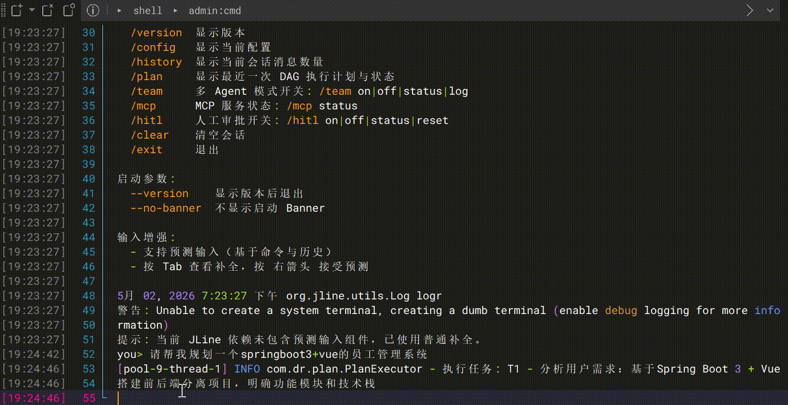
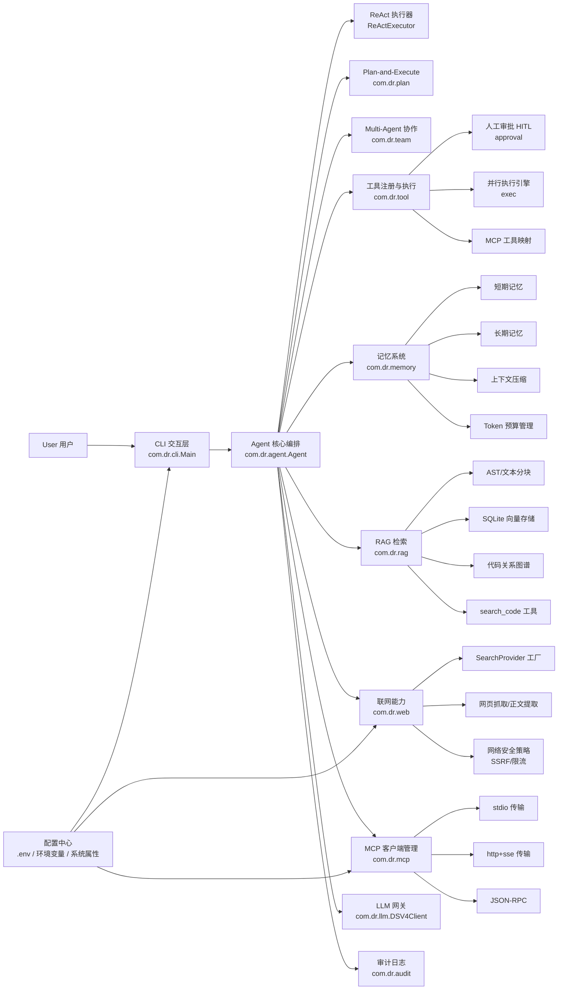

# Dongran CLI

交互式命令行工具。  
技术栈为 Java 21 与 Maven。

## 功能清单

- 多轮会话
- Plan-and-Execute 任务执行
- Multi-Agent 协作
- 并发工具执行
- 长短期记忆与上下文压缩
- Token 预算管理
- 代码检索与调用链分析
- 联网搜索与网页正文提取
- MCP 多服务接入
- 人工审批与审计日志

## 演示 GIF

### 终端交互演示 1



### 终端交互演示 2



## 目录结构

```text
DongranCli/
├─ src/
│  ├─ main/
│  │  └─ java/com/dr/
│  │     ├─ cli/        # 启动入口、配置、会话存储
│  │     ├─ agent/      # Agent 主流程与 ReAct 执行
│  │     ├─ plan/       # Plan-and-Execute 与 DAG 调度
│  │     ├─ team/       # Multi-Agent 协作
│  │     ├─ tool/       # 工具注册、审批、并行执行
│  │     ├─ memory/     # 长短期记忆、压缩、预算管理
│  │     ├─ rag/        # 代码分块、向量检索、关系图谱
│  │     ├─ web/        # 联网搜索与网页抓取
│  │     ├─ mcp/        # MCP 客户端、传输层、服务管理
│  │     └─ audit/      # 审计日志
│  └─ test/
│     └─ java/com/dr/   # 单元测试与集成测试
├─ target/              # 构建产物
├─ install.cmd          # Windows 一键安装命令脚本
├─ install.sh           # macOS/Linux 一键安装命令脚本
├─ pom.xml              # Maven 配置
└─ README.md
```

## 快速开始

### 1. 配置 API Key

任选一种方式：

- 环境变量 `DEEPSEEK_API_KEY`
- 环境变量 `GLM_API_KEY`
- 项目根目录 `.env` 中设置 `DEEPSEEK_API_KEY`
- 项目根目录 `.dongrancli.properties` 中设置 `api.key`
- 用户目录 `~/.dongrancli/config.properties` 中设置 `api.key`

### 2. 编译运行

```bash
mvn clean package
java -jar target/DongranCli-1.0-SNAPSHOT.jar
```

## 命令列表

- `/help` 显示帮助
- `/version` 显示版本
- `/config` 显示配置
- `/history` 显示会话消息数量
- `/plan` 显示最近一次计划执行状态
- `/team` 多 Agent 控制，支持 `on|off|status|log`
- `/mcp` MCP 状态，支持 `status`
- `/hitl` 人工审批控制，支持 `on|off|status|reset`
- `/clear` 清空会话
- `/exit` 退出

## 启动器命令与 PATH

本节用于创建 `dongran` 全局命令。

### Windows

推荐直接使用仓库内安装脚本：

```powershell
.\install.cmd
```

脚本会自动完成以下动作：

- 创建 `%USERPROFILE%\bin`
- 创建 `dongran.cmd` 与 `dongrancli.cmd`
- 将 `%USERPROFILE%\bin` 写入用户级 PATH

```powershell
dongran
```

### macOS Linux

推荐直接使用仓库内安装脚本：

```bash
chmod +x ./install.sh
./install.sh
dongran
```

脚本会自动完成以下动作：

- 创建 `$HOME/bin`
- 创建 `dongran` 与 `dongrancli` 启动脚本
- 更新 `~/.bashrc` 或 `~/.zshrc` 的 PATH

## 联网配置

### 配置优先级

`环境变量 > Java 系统属性 > .env`

### 搜索引擎选择

- `SEARCH_PROVIDER=zhipu`
- `SEARCH_PROVIDER=serpapi`
- `SEARCH_PROVIDER=searxng`

### 最小配置

```env
SEARCH_PROVIDER=searxng
SEARXNG_BASE_URL=https://searx.be
```

### SerpAPI 配置

```env
SEARCH_PROVIDER=serpapi
SERPAPI_API_KEY=your_key
```

### Zhipu 配置

```env
SEARCH_PROVIDER=zhipu
ZHIPU_API_KEY=your_key
ZHIPU_SEARCH_URL=https://open.bigmodel.cn/api/paas/v4/chat/completions
```

### Windows 临时环境变量

```powershell
$env:SEARCH_PROVIDER="serpapi"
$env:SERPAPI_API_KEY="your_key"
```

### 常见问题

- `web_search_failed`：检查 provider 名称与 key
- `web_fetch_failed`：检查 URL 是否可公网访问

## MCP 配置

### 配置项

`MCP_SERVERS`

### 格式

- `stdio` 模式：`name|stdio|command|arg1,arg2,arg3`
- `http` 模式：`name|http|https://your-mcp-host`
- 多服务用分号连接

### 示例

```env
MCP_SERVERS=chrome|stdio|npx|-y,chrome-devtools-mcp@latest
```

```env
MCP_SERVERS=git|stdio|node|mcp-git-server.js,--stdio;docs|http|https://mcp.example.com
```

### 验证

启动后执行：

```text
/mcp status
```

### 工具命名空间

MCP 工具名格式为：`mcp__server__tool`

### 安全策略

- `mcp__` 工具默认进入 HITL 审批
- 审计日志文件为 `.dongran_audit.jsonl`

## 配置项

- `DEEPSEEK_API_KEY` 或 `GLM_API_KEY`
- `DONGRAN_MODEL`
- `DONGRAN_API_URL`
- `MODEL_PROVIDER`
- `OLLAMA_BASE_URL`
- `EMBEDDING_MODEL`

## RAG 说明

- Java 文件按文件类方法分块
- 非 Java 文件按大小分段
- `search_code` 使用语义与关键词混合检索
- 查询调用链时会结合代码关系图谱

## 插件扩展

实现接口 `com.dr.tool.ToolProvider`，并在 `META-INF/services/com.dr.tool.ToolProvider` 注册实现类。  
启动时自动加载插件工具。

## 系统架构图


